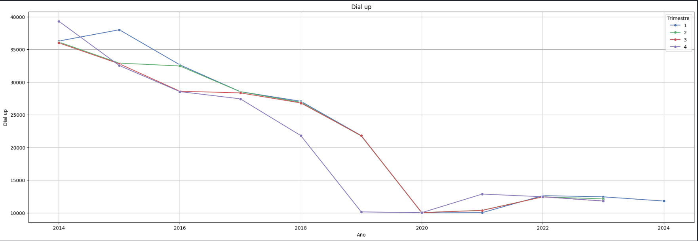

# Individual_Henry_Project2

**Este es el segundo proyecto individual del curso Data Science de Henry.**

## Contexto

Las telecomunicaciones son el proceso de transmitir información a través de distintos medios, los cuales pueden ser electrónicos o físicos, y clasificarse en guiados o no guiados. Entre los medios más comunes se encuentran el teléfono, la televisión, la radio e Internet. En particular, Internet es una red global de computadoras interconectadas que permite el intercambio de información y datos de manera rápida y eficiente.

En este proyecto, actuamos como analistas de datos contratados por una empresa de telecomunicaciones en Argentina. La compañía nos ha solicitado realizar un análisis exhaustivo para identificar el comportamiento del sector a nivel nacional. En esta ocasión, nos enfocaremos exclusivamente en la principal actividad de la empresa: ofrecer servicios de acceso a Internet.

## Tecnologías y herramientas

En este proyecto se utilizó el lenguaje de programación Python en cuadernos de Jupyter. Solo se empleó un cuaderno, que contiene el análisis exploratorio de datos (EDA) y un pequeño proceso de extracción, transformación y carga (ETL). Las principales librerías utilizadas fueron Pandas, Numpy, Matplotlib y Seaborn. Pandas se usó para manipular el dataset de internet de manera eficiente, mientras que Numpy facilitó los cálculos matemáticos, como la obtención de promedios de columnas o características del dataframe. Matplotlib se empleó para generar y ajustar las visualizaciones gráficas, y Seaborn se utilizó para crear las gráficas necesarias para el análisis EDA.

Otra herramienta empleada en el proyecto fue Power BI, elegida por su facilidad de uso y la experiencia previa con la misma.

## Metodología

1. Se reviso el datset de internet en excel y se vio por encima que tipo de datos tenia.
2. Se trajieron todas las hojas al cuaderno de Jupyter para empezar a hacer el anaálisis EDA.
3. Se revidaron primero los valores nulos y los valores iguales a cero.
4. Despúes se revisaron los valores duplicados.
5. Después se revisaron los outliers.
6. Después se reviso los datos con graficas de dispersión y con graficas de lineas, ya que casi todos los datos tienen tiempo.
7. Se prosiguio con la exportación de los dataframes modificados para después importarlos en PowerBi.
8. Se realizo el dashboard en PowerBI.

## Análisis

### Velocidades sin rangos

* Se evidencia que en el rango de velocidad de 0.256 - 10 Mbps existe una tendencia bajista desde el 2017 que es el ultimo año del que se tiene registro en este dataset. Esto nos puede decir que la gente se esta dejando de utilizar este rango de veloidad a nivel nacional.
* Se evidencia que el rango de velocidad de 11 - 100 Mbps tuvo una tendencia alcista hasta 2022 ya que los ultimos dos semestres cierran por debajo de su anteior registro, en los siguientes años también se esta notando que va a empezar una tendencia bajista o neurtra. Además se percibe que es el rango que mayor cantidad de acceoss tiene.
* Para el rango de velocidad 105 - 500 Mbps se evidencia que hay una tendencia alcista desde el año 2019. Se nota también que hubo un salto importante en el número de accesos para el 3 y 4 trimestre del año 2022, sería bueno averiguar que paso en estos trimestres de este año. Este rango de velocidad es el segundo que mayor número de accesos muestra.
* Para el rango de velocidad de 512 - 1000 Mbps se evidencia tambíen una tendencia alcista desde el 2020. Otra cosa a recalacar es que el tercer trimestre del año 2022 y 2023 es muy raro, ya que en 2022 hubo un pico muy alto llegando a los 12000 accesos y ese mismo año se finalizo con aproximadamente 3000 accesos, para el año 2023 el segundo y cuarto timestre estuvieron cerca de estar en los 12000 accesos y el tercer timestre si estuvo cerca a los 6000 accesos. Sería importante revisar que ha pasado en ese trercer trimestre para esos dos años y estar pendiente de los siguientes años.
* Se evidencia que la cantidad de accesos para el rango de velocidad de > 1000 Mbps es de muy pocos, y que en los años 2020 y 2021 hubo un incremento pero este mismo bajo en el año 2022.

---

### Total accesos por tecnología

* Se evidencia que la única tecnología que tiene una tendencia bajista es ADSL, además se evidencia que la tecnología Cablemodem tuvo una tendencia alcista hasta el año 2022, el año 2023 se estanco o tuvo una tenencia neutral.
* Las demás tecnologías tienen tendencias alcistas y la tecnología que tiene más accesos es Cablemodem con aproximadamente 6 millones de accesos, desepués le sigue la fibra óptica con aproximadamente 4 millones, después sigue ADSL con aproximadamente 1 millon y de ultimas esta Wireless con 600 mil.

---

### Penetración población y hogares

* La anterior grafica muestra los valores promedio a nivel nacional de penetración por cada 100 habitantes. La grafica muestra que existe una tendencia alcista desde 2014 que es el primer año que contiene el dataset.
* Algo curioso es que uno esperaria que en el último trimestre siempre se terminara con la mayor penetración, pero esto no sucede para los años 2017 y 2019, estos datos son muy extraños por lo que tocaría revisar que paso en el último trimestre de estos dos años.

* La grafica muestra una tendecia alicsta desde el año 2014, que es el año más antiguo que tiene el dataset.
* Con este dataframe pasa lo mismmo que con el anterior y es que para el año 2017 y 2019 no se finalizo con la mayor penetración, lo cual es raro y merece que se investigue el porque.
* Ambas graficas, la anterior y esta muestran que puede haber una fuerte correlación entre la penetración por cada 100 habitantes y la penetración cada 100 hogares.

---

### Banda ancha fija y Dial Up

* De las anteriores graficas se evidencia que la tecnología de banda ancha fija tiene una tendencia alcista, mientras que la tecnología Dial up tiene una tendencia bajista. Además se evidencia que la tecnología de banda ancha fija esta cerca de los 500 mil accesos, mientras que la tecnología Dial up tiene aproximadamente 500 accesos.

---

### Ingresos

* Se evidencia que los ingresos en el area de las telecomunicaciones tiene una tendencia alcista, y que entre el cuarto trimestre del año anterior y el primer trimestre del año actual hay un espacio que cada vez crece más por lo que se puede creer que ingresa mucho dinero entre el el fin del cuarto trimestre y el fin del primer trimestre.

## Conclusiones

* La hoja Velocidad_sin_Rangos contiene el historial de todos los accesos por provincia y por velocidad para cada trimestre desde el cuarto trimestre del 2017. La hoja Acc_vel_loc_sinrangos muestra la cantidad de accesos por velocidad para cada partido y localidad de cada provincia. Si se suman los datos de cada velodcidad individualmente por cada provincia sera el mismo dato que el que arroja la hoja Velocidad_sin_Rangos para el primer trimestre del año 2024 para la correspondiente provincia.

* Para las hojas Accesos_tecnologia_localidad y Accesos Por Tecnología, sucede lo mismo que esta descrito en el anterior punto.

* El hecho de que hayan muchos valores iguales a cero en alguna columna o característica sesgan los datos y pueden hacer que uno perciba que hay muchos valores como outliers.

* Se observan tendencias alcistas en los siguientes rangos de velocidad, 105 - 500 Mbps y 512 - 1000 Mbps. el rango de 11 a 100 Mbps parece que va a tender a una tendencia neutral o va empezar una tendencia bajista.

* Se percibe que desde el año 2016 o 2017 hay una tendencia alcista al consumo de Mbps para descarga.

* Aunque cable modem tenga una tendencia neutal por el momento es la tecnolgía con mayor cantidad de accesos a nivel nacional.

* La única velocidad que muestra una tendencia alcista es la de más de 30 Mbps, las demás demuestran tendencias bajistas o neutras.